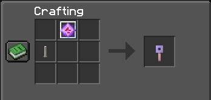

# ChellCraft
Official Fabric server mod for the EFSC

## Features

### Hat: Put any item on your head!
- Use `/hat` while holding the item in your main hand
- If you're already wearing something on your head, it'll be swapped with your hand

### Sit: Right-click on a chair to take a seat!
- Must use empty hand on the top-facing part of a block
- A chair is a bottom slab, bottom stair, unlit campfire, or horizontal end rod, with at least one adjacent sign or trapdoor
- A chair must have a non-opaque block above.
- 1-second cooldown on sitting in a chair

### Invisible ItemFrames & Armor Stands!

- Shoot an invis arrow to make them invisible!
- The ItemFrame must be filled & ArmorStand must be carrying 1 item (armor or hands) for this to work
- Use a splash water bottle to make them visible again! Also works on other entities!
- If you remove all visible items, the invisible ItemFrame/ArmorStand will break off

### Armor Stands: Arms & Poses!

- Sneak + Use 2 sticks to add arms to an armor stand in the world
- Sneak + Use shears to break the arms off again
- Sneak + Use a pickaxe to remove the armor stand base plate
- Sneak + Use a smooth stone slab to add the base plate again
- Sneak + Use a music disc to set the armor stand pose! Discs are not consumed.

### Turbo Encabulator!

- Craft using an End Crystal diagonally-above an End Rod.
- Sneak + Use on an armor stand to cycle through all poses.
- Sneak + Use on a block to copy its state, and Use to paste on other similar blocks.
    - Works on: Stairs, Slabs, Fences, Furnaces, Iron Bars, Walls, Glass Panes, Lanterns

### Help
- Use `/chellcraft` in-game to get a link back to this document at any time!
